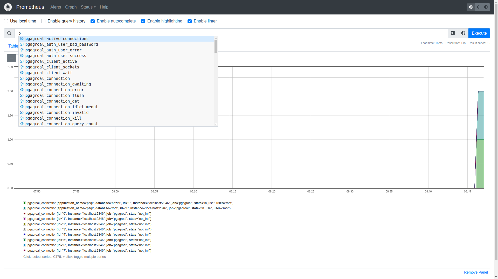

# Prometheus metrics for `pgagroal`

This tutorial will show you how to do basic  [Prometheus](https://prometheus.io/){:target="_blank"} setup  for `pgagroal`.

`pgagroal` is able to provide a set of metrics about what it is happening within the pooler,
so that a Prometheus instance can collect them and help you monitor the pooler.

## Preface

This tutorial assumes that you have already an installation of PostgreSQL 10 (or higher) and `pgagroal`.

In particular, this tutorial refers to the configuration done in [Install pgagroal](https://github.com/pgagroal/pgagroal/blob/master/doc/tutorial/01_install.md).

## Change the pgagroal configuration

In order to enable to export of the metrics, you need to add the `metrics` option in the main `pgagroal.conf` configuration. The value of this setting is the TCP/IP port number that Prometheus will use to grab the exported metrics.

Add a line like the following to `/etc/pgagroal/pgagroal.conf` by editing such file with your editor of choice:

```
metrics = 2346
```

Place it withing the `[pgagroal]` section, like

```
[pgagroal]
...
metrics = 2346
```

This will bind the TCP/IP port number `2346` to the metrics export.

See [the `pgagroal` configuration settings](https://github.com/agroal/pgagroal/blob/master/doc/CONFIGURATION.md#pgagroal) with particular regard to `metrics`, `metrics_cache_max_age` and `metrics_cache_max_size` for more details.

## Restart pgagroal

In order to apply changes, you need to restart `pgagroal`, therefore run the following commands
as the `pgagroal` operating system user:

```
pgagroal-cli -c /etc/pgagroal/pgagroal.conf stop
pgagroal -c /etc/pgagroal/pgagroal.conf -a /etc/pgagroal/pgagroal_hba.conf
```

If you need to specify other configuration files, for example for remote management (see [the related tutorial](https://github.com/pgagroal/pgagroal/blob/master/doc/tutorial/03_remote_management.md)), add them on the `pgagroal` command line.
If the cofiguration files have standard names, you can omit them.

## Get Prometheus metrics

Once `pgagroal` is running you can access the metrics with a browser at the pooler address, specifying the `metrics` port number and routing to the `/metrics` page. For example, point your web browser at:

```
http://localhost:2346/metrics
```

It is also possible to get an explaination of what is the meaning of each metric by pointing your web browser at:

```
http://localhost:2346/
```

## Viewing using prometheus server

If you have a prometheus server running, you can view the 
metrics inside the server, you simply need to add the metrics endpoint to prometheus

E.g the config below

```yaml
# This skips some global config things
scrape_configs:
  # The job name is added as a label `job=<job_name>` to any timeseries scraped from this config.
  - job_name: "prometheus"

    # metrics_path defaults to '/metrics'
    # scheme defaults to 'http'.

    static_configs:
      - targets: ["localhost:9090"] 

  #  This adds pgagroal to prometheus webserver
  # With this, pgagroal metrics will be visible in the prometheus server
  - job_name: "pgagroal"
    static_configs:
      - targets: ["localhost:2346"]
```

And using the command ` prometheus --config.file=./pgagroal.yml` (where `pgagroal.yml` is the above config)
you can view `pgagroal` metrics in prometheus server.


